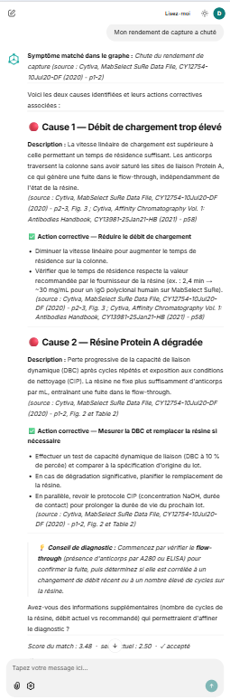
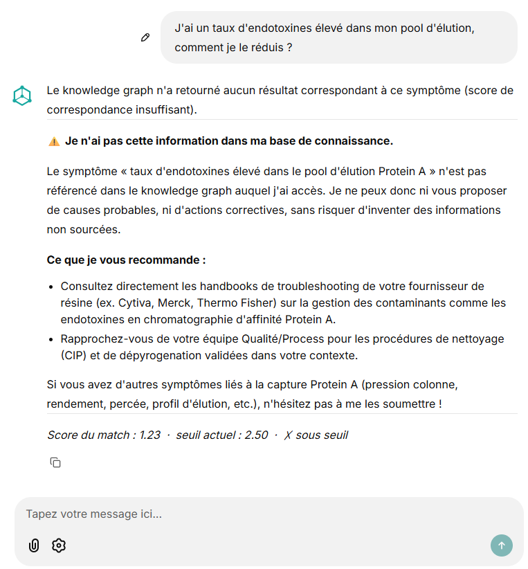
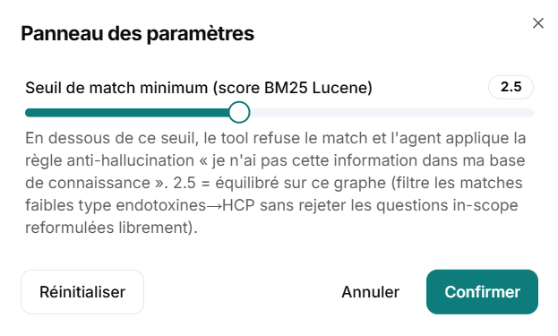
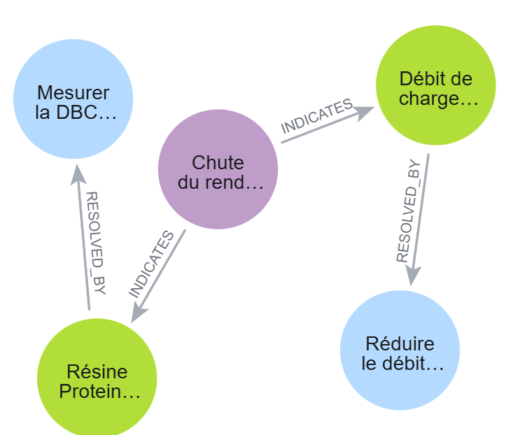
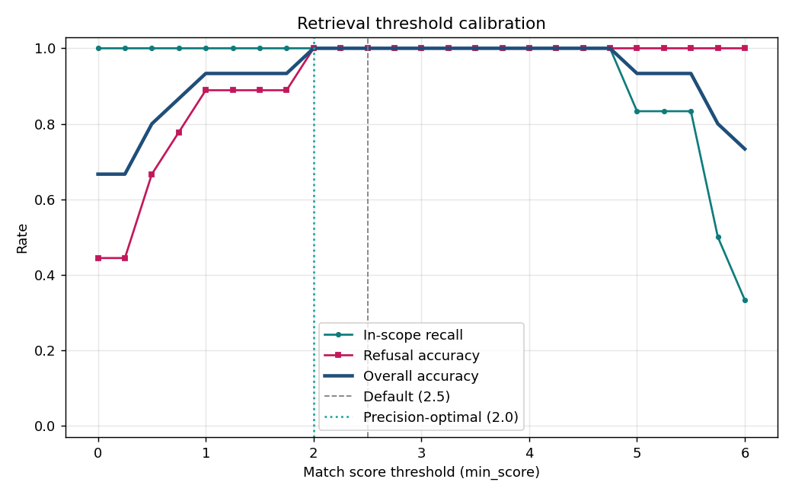

# Bioprocess Troubleshooting Assistant

An AI assistant demonstrator for **troubleshooting Protein A capture chromatography** (a downstream bioprocess unit operation). Given a symptom described in natural language, the agent returns the probable causes and corrective actions - every answer grounded in a knowledge graph and sourced from a public handbook.

The project validates a simple hypothesis: *can we build an agent a process engineer would find credible, with verifiable citations and zero tolerated hallucination, in the regulated context of biopharma?*

> **Language note:** the docs, the code, and the **knowledge graph content are all in English** (the source Cytiva handbooks are English). The assistant **answers in the user's language** - ask in French or English. The example prompts below are in French to mirror the original demo; English works identically. How the bilingual behavior is achieved is covered under *Under the hood*.

## Live demo

The assistant is deployed and accessible: **https://bioprocess-assistant.onrender.com**

Access is password-protected to keep usage under control (the agent consumes API tokens on every request). **Demo credentials are available on request** - reach me by email ([gaelmukunde@gmail.com](mailto:gaelmukunde@gmail.com)) or on [LinkedIn](https://www.linkedin.com/in/gaelmukunde/).

> ℹ️ Hosted on Render's free tier: the first request after a period of inactivity can take ~30 s (container cold start), and the AuraDB instance may also need to wake up.

## Preview

**Sourced answer** - from a natural-language symptom, the agent returns the probable causes and corrective actions, each citing its source (handbook page). The answer footer shows the match score and the current threshold.



**Anti-hallucination guardrail** - for a symptom absent from the graph (here, endotoxins), the agent explicitly declines rather than inventing an answer.



**Adjustable match threshold** - the slider exposes the Lucene score threshold at runtime, illustrating the retrieval precision / recall trade-off.



## Three target architecture layers

This POC implements only the causal layer. The other two are the natural evolution toward a real industrial use.

| Layer | What it models | Approach | Status |
|---|---|---|---|
| **Causal** | Symptom → Cause → Action | Hand-curated Neo4j knowledge graph + Claude agent | ✅ this POC |
| **Topological** | Equipment, connections, instrumentation | ChatP&ID pattern (extraction from P&IDs) | Future |
| **Operational** | Phases, states, KPIs, alarms | *Fabric IQ*-style ontology over an industrial data fabric | Future |

The central challenge in moving from a single-layer POC to a multi-layer system is **entity alignment**: ensuring the same column C-101 is the same node (or explicitly linked nodes) across all three layers, with an unambiguous shared identity.

## POC architecture

A minimal walking skeleton in three decoupled bricks:

1. **Neo4j knowledge graph** (AuraDB Free) - domain knowledge modeled as `(:Symptom)-[:INDICATES]->(:Cause)-[:RESOLVED_BY]->(:Action)`. Every node carries a mandatory `source` field pointing to a precise page of a public handbook.
2. **Claude agent** (Anthropic SDK, Sonnet 4.6) with a single exposed tool: `query_graph(symptom)`. The system prompt enforces: *answer only from the data returned by the tool, cite every source, and explicitly state "I don't have this information" when out of scope.*
3. **Chainlit UI** that routes user messages to the agent.

The knowledge graph visualized in the Neo4j browser - each symptom points to its causes (`INDICATES`), each cause to its corrective actions (`RESOLVED_BY`):



Architecture decisions are detailed in [`docs/ADR-001-knowledge-graph-grounding.md`](docs/ADR-001-knowledge-graph-grounding.md).

## Stack

- Python 3.11+ (tested on 3.10+)
- Neo4j AuraDB Free (free tier, ~200k nodes allowed - well above the POC need)
- Anthropic SDK + Claude Sonnet 4.6
- Chainlit for the conversational UI (password auth + custom theme and branding)
- Deployment: Docker + Render (free tier, auto-deploy on push)
- Configuration via environment variables (`.env`, never committed)

## Setup

### 1. Provision a Neo4j AuraDB Free instance

- Go to [console.neo4j.io](https://console.neo4j.io/) and create an account
- Create an **AuraDB Free** instance
- ⚠️ The password is shown only once at creation - save the connection `.txt` file

### 2. Clone and install

```bash
git clone https://github.com/mukunde/bioprocess-assistant.git
cd bioprocess-assistant
python3 -m venv .venv
source .venv/bin/activate          # on Windows: .venv\Scripts\activate
pip install -r requirements.txt
```

### 3. Configure

```bash
cp .env.example .env
```

Edit `.env` with the AuraDB instance values and your Anthropic key (from [console.anthropic.com](https://console.anthropic.com)).

For Chainlit authentication, generate a JWT secret and set the demo credentials:

```bash
chainlit create-secret        # copy the value into CHAINLIT_AUTH_SECRET in .env
```

Then set `DEMO_USERNAME` / `DEMO_PASSWORD` (the shared login credentials).

### 4. Load the graph

```bash
python scripts/load_graph.py
```

The script applies the schema (uniqueness constraints + a full-text index with an English analyzer) then the seed (6 symptoms / 12 causes / 12 actions, all sourced). It validates on exit by printing the 12 causal paths.

## Run

```bash
chainlit run app.py -w
```

The app opens at [http://localhost:8000](http://localhost:8000).

Under each answer, the UI shows the **Lucene match score** and the **current threshold**. The threshold is adjustable at runtime via the ⚙️ Settings icon in the input box - handy in a demo to illustrate the precision / recall trade-off (see *Under the hood* below).

## Deployment

The app runs in a Docker container (see `Dockerfile`). The reference deployment is on **Render** (Web Service, Docker runtime, free tier):

- Automatic build from the GitHub repo, redeploy on every push (`Auto-Deploy: On Commit`)
- Secrets (Neo4j, Anthropic, Chainlit auth) are provided via the service's environment variables - never committed
- `.chainlit/config.toml` and the `public/` folder (logo, favicon, theme CSS/JS) are version-controlled so the branding follows into production

Local image build:

```bash
docker build -t bioprocess-assistant .
docker run -p 8000:8000 --env-file .env bioprocess-assistant
```

## Demo questions

The agent covers six typical Protein A capture symptoms (graph nodes, in English):

- Capture step yield drop
- High column pressure
- Aggregates / HMW in the elution pool
- High Protein A leaching in the eluate
- High residual HCP in the elution pool
- Bioburden or microbial contamination

Ask in French or English - the agent answers in your language. Prompts that work (French shown):

- *« Mon rendement de capture a chuté, qu'est-ce qui peut le causer ? »*
- *« La pression de ma colonne est anormalement élevée, comment je règle ça ? »*
- *« J'ai trop d'agrégats dans mon pool d'élution. »*

To stress the anti-hallucination guarantee - three distinct refusal patterns, all tested:

- *« J'ai un taux d'endotoxines élevé dans mon pool d'élution, comment je le réduis ? »* → **in-domain miss**: symptom not covered by the graph, the agent replies "I don't have this information in my knowledge base"
- *« Comment optimiser mon procédé d'ultrafiltration / diafiltration ? »* → **another unit operation**: the agent flags it as out of scope
- *« Quelle est la météo aujourd'hui ? »* → **fully off-topic**: the agent politely declines

## Under the hood - how retrieval works

### Bilingual matching: the agent bridges to English, then BM25 full-text

The graph content is English. The system handles French (or English) questions through the **agent itself**: the LLM reads the question in any language and extracts an **English search phrase** for the `query_graph` tool (e.g. *« Mon rendement de capture a chuté »* → `capture yield drop`), then answers in the user's language. So `query_graph` always receives English - the multilingual capability lives where it is cheapest and most reliable, in the agent's tool-use.

`query_graph` then queries a **Neo4j full-text index** over `Symptom.name`, `Symptom.description`, and a curated `Symptom.keywords` field, using the **`english` Lucene analyzer** (tokenization, English stop-word removal, stemming). The `keywords` field holds discriminative English synonyms (e.g. "overpressure", "HMW") to widen recall on paraphrases.

> A multilingual **vector** retrieval layer was prototyped as an alternative bridge and measured - then *not* shipped, because it weakened refusal precision for no recall gain. See [ADR-002](docs/ADR-002-multilingual-retrieval.md).

### BM25 score - relevance of a match

Each match gets a **BM25 score** (modern Lucene's default algorithm), combining:

- **TF** (term frequency) - how often each query term occurs in the indexed document
- **IDF** (inverse document frequency) - rare terms weigh more than common ones
- **Length normalization** - very long documents are slightly penalized

In practice on this graph (the agent's extracted English phrase is what gets scored):

- `capture yield drop` against the yield-drop node → rare terms ("yield", "drop") match → score ~5
- `endotoxin in elution pool` against the HCP node → "endotoxin" is in no document, only "elution/pool" (common terms) match → score ~2 → below threshold → correctly refused

### The match threshold (`min_score`)

`query_graph` applies a **minimum threshold** (default 2.5, adjustable via the Settings slider in the UI):

- Score **≥** threshold → match accepted, the tool returns the node with causes + actions
- Score **<** threshold → the tool returns `found: false`, and the agent applies the anti-hallucination rule

The 2.5 threshold was calibrated empirically over the 6 symptoms of the graph to reject weak false positives (e.g. endotoxins→HCP via shared generic keywords) without rejecting in-scope questions phrased freely.

### Three distinct agent behaviors

The system prompt (see `agent.py`) anchors **6 non-negotiable rules**:

1. **Tool data only**: never add a cause, action, or source from the LLM's general knowledge
2. **Cite the `source`** of every cause and action mentioned in the answer
3. **If the tool returns `found: false`**, explicitly say *"I don't have this information in my knowledge base"*, invent nothing
4. **If the question is out of scope** (a unit operation other than Protein A capture, or a non-troubleshooting topic), flag it and don't answer on the merits
5. **When declining** (rule 3 or 4), keep it brief and fabricate no external reference (vendor, handbook, standard) beyond the tool output
6. **Answer in the user's language** (French or English)

Rules **1 and 2** govern *how* the agent answers when it has a match (format and traceability). Rules **3 and 4** govern *when* the agent declines. Together they produce three observable behaviors:

| Case | Mechanism | Response |
|---|---|---|
| **Valid match** | BM25 score ≥ threshold → tool returns `found: true` | Structured causes + actions with source citations (Rules 1 & 2) |
| **In-domain miss** | Tool returns `found: false` (graph holds nothing above the threshold) | "I don't have this information in my knowledge base" (Rule 3) |
| **Out of scope** | The LLM judges semantically that the question is outside the domain | "This question is out of my scope" (Rule 4) |

The in-domain miss vs out-of-scope distinction rests on **two different mechanisms**:

- The **Lucene score** triggers Rule 3 - a *numerical* decision on match quality.
- The **LLM's semantic judgment** triggers Rule 4 - a *qualitative* decision on the nature of the question.

Both can co-occur (an out-of-scope question probably matches nothing either), but the LLM prioritizes Rule 4 when it's semantically clear (e.g. *« quelle est la météo aujourd'hui ? »* is declined as out of scope before a tool call is even made).

### Why a knowledge graph and not vector RAG?

Three reasons (details in [`docs/ADR-001-knowledge-graph-grounding.md`](docs/ADR-001-knowledge-graph-grounding.md)):

1. **Auditability**: every answer traces back to an identified PDF page, not to one chunk among N
2. **Explicit causal structure**: `symptom → cause → action` is a relation, not a semantic proximity
3. **Anti-hallucination by construction**: the agent only reaches the world through the tool; it cannot *"fill in from its general knowledge"* without violating the system prompt

### A vector experiment that didn't ship

To bridge French questions to the English graph, I prototyped a multilingual **vector** retrieval layer (Voyage embeddings + a Neo4j-native vector index, fused with BM25) as an alternative to the agent bridge - and measured it against the evaluation suite.

It was the wrong trade. The vector arm could not separate **near-domain misses** from in-scope questions: an out-of-graph *"endotoxins"* query scored as similar to the graph (cosine ~0.75) as a real symptom, so no similarity threshold could refuse it without also rejecting legitimate questions. That directly weakens the refusal guarantee - the core of the anti-hallucination thesis - while the agent bridge already delivered **100% in-scope recall** without any of it. So I kept the simpler design and did not ship vectors.

The full data and reasoning - including why, *if* vectors are ever revisited, they belong **inside** Neo4j rather than a separate vector store (so one Cypher query does both the similarity search and the graph traversal, no second source of truth to sync) - are in [ADR-002](docs/ADR-002-multilingual-retrieval.md). Knowing when *not* to add complexity is part of the design.

## Evaluation

A reproducible suite (`eval/`) measures the agent's contract - retrieval, refusals, anti-hallucination, and sourcing - at two levels:

| Level | What it checks | Cost |
|---|---|---|
| **Tool-level** | `query_graph` returns the right symptom (or correctly nothing) | Free, deterministic |
| **Agent-level** | Full agent answers: no hallucination, sources cited, correct refusals | LLM-as-judge (API tokens) |

The dataset (`eval/cases.yaml`) holds 28 **bilingual** cases: 19 in-scope questions (French *and* English paraphrases per symptom) and 9 that must be refused (in-domain misses, other unit operations, off-topic).

### Results

**Agent-level (LLM-as-judge)** - the headline: the full bilingual system, measurably grounded.

```
In-scope (19, FR + EN):   answered 19/19  ·  sources cited 19/19
Refusals (9):             clean (no fabricated cause / action / source)
Hallucination-free:       ~27-28 / 28
```

In-scope questions in both languages are answered with sources; out-of-graph and out-of-scope questions are refused. Hallucination-free hovers at 27-28/28 across runs (LLM judging has minor run-to-run variance; the rare flag is an over-helpful embellishment, not an invented cause, action, or source).

**Threshold calibration (BM25 retrieval component)** - `query_graph` always receives English (the agent bridges), so the BM25 threshold is calibrated on English queries. Sweeping it shows **100% recall *and* 100% refusal across a wide plateau** - the default **2.5 sits squarely in it**. The threshold is deliberately biased toward clean refusals: in a regulated setting a confident wrong answer is worse than an honest "I don't know".



### Eval-driven engineering

The suite didn't just score the agent - it drove the design, visible in the git history:

1. **Recall gaps → discriminative keywords.** The baseline missed paraphrases (e.g. "overpressure", "host cell proteins"). Fix: a curated, *discriminative* `keywords` field per symptom in the full-text index. Generic terms ("Protein A", "elution pool") were deliberately excluded - the eval caught that they restored recall but **regressed precision** (false matches on out-of-scope questions).
2. **Refusal-path fabrication → prompt hardening.** The judge caught the agent inventing external references (vendor handbooks, standards) while *correctly* declining. Fix: a system-prompt rule forbidding any fabricated reference in a refusal.
3. **Vector retrieval → measured and dropped.** A multilingual vector layer was prototyped to bridge French questions; the eval showed it weakened refusal precision for no recall gain, so it was not shipped ([ADR-002](docs/ADR-002-multilingual-retrieval.md)).

### Running it

```bash
python eval/run_eval.py                      # tool-level (free, deterministic)
python eval/run_eval.py --agent              # + agent-level LLM judge (API tokens)
python eval/run_eval.py --agent --limit 1    # smoke test: 1 case per type
python eval/threshold_sweep.py               # regenerate the calibration plot
```

See [`eval/README.md`](eval/README.md) for details.

### Tooling: why a custom suite (considered alternatives)

I considered standard LLM-eval frameworks (Ragas, Giskard) and chose a custom suite deliberately:

- **Ragas** targets vector-RAG pipelines (question → retrieved text chunks → answer). This agent is grounded on a *structured knowledge graph*, not retrieved chunks, so Ragas' context-precision/recall metrics don't map cleanly - and the grounding it would measure (faithfulness) is already covered, more transparently, by the LLM-judge here.
- **Giskard** brings a different axis - adversarial robustness and security (prompt injection, jailbreaks) - that this *correctness* suite does not cover. That's genuinely complementary, and it's on the roadmap.

A hand-built suite also keeps the metrics legible and tailored to the domain contract, rather than bending generic RAG metrics to fit a graph-grounded agent.

## Assumed limitations

- A demonstrator POC, **not a GxP-grade system**
- Scope restricted to **a single unit operation** (Protein A capture)
- Public sources only (Cytiva handbooks), no internal data
- AuraDB Free pauses the instance after a few days of inactivity - wakeable in one click from the console
- Answer quality depends entirely on graph curation: *garbage in, garbage out*

## Roadmap

- **Short term**: an **ingestion pipeline** (handbook PDF → LLM extraction of `Symptom/Cause/Action` triples → graph), with a human-in-the-loop review step - to thicken the graph from more public handbooks (Merck-Millipore, Sartorius) without hand-writing Cypher
- **Short term**: **adversarial / robustness evaluation** (Giskard-style) - prompt-injection and jailbreak resistance, a security axis the current correctness suite does not cover (especially relevant in a regulated context)
- **Medium term**: add the **topological** layer (ChatP&ID pattern - extracting P&IDs into a KG)
- **Medium term**: add the **operational** layer (ontology over an industrial data fabric), with shared identity management across layers
- **Possible complementary evolution**: a vector RAG layer on top of the graph for open questions not covered by the relational model - as a complement, never a replacement for the structured truth

## Repo structure

```
bioprocess-assistant/
├── agent.py                                # Claude agent loop + anti-hallucination prompt
├── app.py                                  # Chainlit UI + password auth
├── chainlit.md                             # Chainlit welcome page
├── tools.py                                # query_graph tool (Neo4j full-text, score threshold)
├── requirements.txt
├── Dockerfile                              # deployment image (Render)
├── .dockerignore
├── scripts/
│   └── load_graph.py                       # schema + seed Cypher loader (idempotent)
├── graph/
│   ├── schema.cypher                       # uniqueness constraints + English full-text index
│   └── seed.cypher                         # 6 symptoms × 2 causes × 2 actions (English), sourced + keywords
├── eval/
│   ├── cases.yaml                          # evaluation dataset (in-scope + refusal cases)
│   ├── run_eval.py                         # tool-level + agent-level (LLM-judge) runner
│   ├── judge.py                            # LLM-as-judge (hallucination + sourcing)
│   ├── threshold_sweep.py                  # threshold calibration sweep + plot
│   └── threshold_calibration.png
├── public/                                 # branding: logo/favicon/avatar SVG, custom.css, login.js
├── .chainlit/
│   └── config.toml                         # theme, avatar, custom CSS/JS, login page
├── docs/
│   ├── ADR-001-knowledge-graph-grounding.md  # architecture decision: KG grounding
│   └── ADR-002-multilingual-retrieval.md     # decision: bilingual via agent, vectors not shipped
├── references/                             # handbook PDFs (gitignored)
└── CLAUDE.md                               # project context for Claude Code
```
